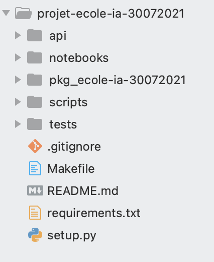

# Projet Template Projet

## Objectif

1. Générer un template de projet - deadline Mardi 3 aout
2. Créer un projet ML simple - deadline Mardi 10 aout
3. Créer l’API - deadline Mardi 10 aout
4. Créer un container docker - deadline Mardi 13 aout
5. Déployer le projet ML en production - deadline Mercredi 14 aout
6. Utiliser une interface Front-end simple qui consomme l’API - deadline Mardi 17 aout

## Structure Template


## Rappels
* Pour lancer package depuis Github :
````shell
pip install git+https://github.com/url.git
````
---
* Liens :
    * https://pypi.org/project/setuptools/
    * https://docs.python-guide.org/writing/structure/#modules
    * https://anweshadas.in/how-to-upload-a-package-in-pypi-using-twine/
    * https://pypi.org/project/incremental/
---
* Pour chaîner des tâches dans votre Makefile :

```python


toto:
    @echo toto

coco:
    @echo coco

all: toto coco
```


